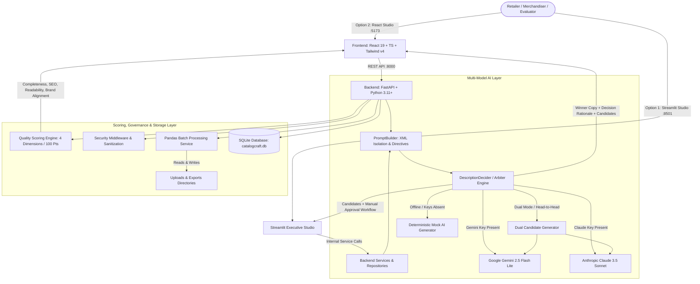

# CatalogCraft AI — Enterprise Retail Product Description Generator

> **TCS Technology Day Prototype**  
> *“Generate compelling, consistent, SEO-ready retail product content at scale with multi-model AI arbitration.”*

CatalogCraft AI is an enterprise AI copywriting and catalog intelligence platform. It ingests structured retail product specifications and automatically generates high-converting, brand-aligned, and SEO-optimized product copy. It features a multi-model architecture supporting **Google Gemini (Gemini 2.5 Flash Lite)**, **Anthropic Claude (Claude 3.5 Sonnet)**, an intelligent **Dual-Engine Arbitration Decider** with side-by-side candidate comparison and manual approval workflow, and a deterministic **Mock AI Engine** for zero-latency, offline demonstrations.

The platform provides two complete client interfaces:
- **Option 1: Streamlit Executive Studio** (`http://localhost:8501`) — A single-process dashboard with interactive studio navigation, side-by-side candidate cards, catalog exploration, batch uploads, and live metrics.
- **Option 2: React 19 + TypeScript + Tailwind CSS Production Studio** (`http://localhost:5173`) — An enterprise web studio with dark/light theme switching, live scoring panels, in-place copy editing, version history, Recharts analytics, and batch workflow management connected to a **FastAPI** backend (`http://localhost:8000`).

---

## 🏗️ System Architecture




---

## 🌟 Key Platform Features

### 1. Multi-Model AI Generation & Dual-Engine Decider
- **Dual-AI Arbiter Mode**: Generates candidate copy from both **Google Gemini** and **Anthropic Claude**, computes weighted scores across all 4 quality dimensions, and selects the optimal winner with transparent comparative rationale.
- **Side-by-Side Candidate Comparison**: Both Streamlit and React interfaces display both Gemini and Claude outputs simultaneously with metrics and a **1-click manual approval workflow**.
- **Model Switching**: Run independently with Gemini (`gemini-2.5-flash-lite`), Claude (`claude-3-5-sonnet-20241022`), or Dual Arbitration.
- **Offline Deterministic Fallback**: Automatic, zero-latency realistic generation when API keys are not supplied.

### 2. Single Product Copy Generator
- Structured input form: Title, Category, Brand, Price, Currency, Technical Specs/Features, Target Audience, and Focus Keywords.
- **"Load Sample Product"**: Instant 1-click test data loader across popular retail categories.
- Generated copy package:
  - **SEO Product Title**: Keyword-rich headline tailored for marketplace search algorithms.
  - **Short Hook Description**: Concise, high-converting summary for listing cards.
  - **Full Description**: Detailed, benefits-driven narrative for product detail pages.
  - **Bullet Highlights**: 4–5 scannable key benefit bullets.
  - **SEO Metadata**: Optimized Meta Title (under 60 chars) and Meta Description (under 160 chars).
  - **Suggested Search Keywords**: High-intent search terms.

### 3. Transparent 4-Dimensional Quality Scoring (100 Pts)
- **Completeness (30%)**: Checks incorporation of core specs, materials, and target audience.
- **SEO Optimization (30%)**: Verifies keyword frequency, meta tag lengths, and structure.
- **Readability (20%)**: Computes Flesch-Kincaid Grade Level and sentence clarity.
- **Brand Tone Alignment (20%)**: Enforces selected voice tone and audits against prohibited/banned words.

### 4. High-Throughput Batch Generation & File Upload
- Drag-and-drop CSV and JSON catalog ingest with row-level validation.
- Real-time progress tracking with status badges (`Queued`, `Processing`, `Completed`, `Failed`).
- Isolated row retry mechanism without rerunning the full catalog.
- Downloadable starter datasets (`sample_products.csv` and `sample_products.json`) with 50+ retail SKUs.

### 5. Product Catalogue & Editorial Workflow
- Live catalog search and multi-criteria filters (Category, Brand, Tone, Approval Status, Score Range).
- Side-by-side inspection modal comparing input specs with generated copy.
- In-place copy editing with audit stamps (`Human Edited`) and version history tracking.

### 6. Executive Business Intelligence & Analytics
- Visual analytics covering generation volume trends, category breakdown, score distributions, and tone usage.
- Plain-language business commentary beneath every metric.
- Instant CSV and JSON report exports.

### 7. Brand Voice & Governance Rules
- Configure brand tone presets, required phrases, and prohibited/banned vocabulary.
- Live system prompt inspection and rule test sandbox.

### 8. Built-in Security Hardening
- **CSV Formula Injection Defense (CWE-1236)**: Sanitizes all exported cells against spreadsheet formula execution (`=`, `+`, `-`, `@`, `\t`, `\r`).
- **Upload File Size Limitation (CWE-400)**: Enforces a 15 MB cap with chunked streaming validation to prevent memory exhaustion (DoS).
- **HTTP Security Headers (CWE-693)**: Enforces `X-Content-Type-Options: nosniff`, `X-Frame-Options: DENY`, `X-XSS-Protection: 1; mode=block`, and strict referrer policy.
- **Indirect Prompt Injection Defense (OWASP LLM01)**: Delimits product attributes within `<PRODUCT_DATA>` XML tags and instructs models to treat enclosed content strictly as untrusted data.

---

## 📂 Project Directory Structure

```text
catalogcraft-ai/
├── .gitignore                                 # Git ignore rules (DBs, env, uploads, node_modules)
├── .streamlit/                                # Global Streamlit styling and server configuration
│   └── config.toml                            # Dark theme tokens, port, and security settings
├── .vscode/                                   # IDE editor settings
│   └── settings.json                          # Tailwind CSS custom at-rules lint configuration
├── README.md                                  # Complete platform documentation
├── catalogcraft.db                            # SQLite database (auto-seeded on startup)
├── run_app.bat                                # Windows 1-click launcher for Option 2 (React + FastAPI)
├── run_streamlit.bat                          # Windows 1-click launcher for Option 1 (Streamlit Studio)
│
├── backend/                                   # FastAPI Backend & Streamlit Application
│   ├── .env.example                           # Backend environment template
│   ├── .streamlit/config.toml                 # Streamlit theme and runtime configuration
│   ├── requirements.txt                       # Python dependencies (FastAPI, Google GenAI, Anthropic, Streamlit)
│   ├── streamlit_app.py                       # Standalone Streamlit Executive Studio (Option 1)
│   ├── create_demo_upload_csv.py              # Script to generate sample demo upload CSVs
│   ├── generate_100_products.py               # Seed utility generating 100 realistic catalog items
│   ├── generate_electronics_fashion_110.py    # Seed utility generating 110 electronics & fashion items
│   │
│   ├── app/                                   # FastAPI Application Package
│   │   ├── config.py                          # Pydantic BaseSettings environment loader
│   │   ├── database.py                        # SQLAlchemy engine, session maker, Base declarative
│   │   ├── dependencies.py                    # FastAPI dependency injection (DB sessions)
│   │   ├── main.py                            # FastAPI app, security headers, CORS, lifespan startup
│   │   │
│   │   ├── models/                            # SQLAlchemy Database ORM Models
│   │   │   ├── batch.py                       # BatchJob and BatchItem models
│   │   │   ├── brand_settings.py              # BrandSettings model (tones, banned words, disclaimers)
│   │   │   ├── generated_content.py           # GeneratedContent and ContentVersion models
│   │   │   └── product.py                     # Product model (SKU, title, category, price, specs)
│   │   │
│   │   ├── repositories/                      # Data Access Layer (CRUD Abstractions)
│   │   │   ├── content_repository.py          # Content query, versioning, and update methods
│   │   │   └── product_repository.py          # Product search, filter, pagination, and seed methods
│   │   │
│   │   ├── routers/                           # REST API Endpoints
│   │   │   ├── analytics.py                   # /api/analytics/overview metrics and distributions
│   │   │   ├── batch.py                       # /api/batch/upload, /api/batch/{id}/process, status
│   │   │   ├── export.py                      # /api/export/{format} CSV and JSON catalog download
│   │   │   ├── generation.py                  # /api/generate-description, /api/decide-description
│   │   │   ├── health.py                      # /api/health service check and engine status
│   │   │   ├── products.py                    # /api/products listing, filters, and detail
│   │   │   └── settings.py                    # /api/settings/brand voice guidelines and rules
│   │   │
│   │   ├── schemas/                           # Pydantic v2 Request/Response Validation Schemas
│   │   │   ├── batch.py                       # Batch upload and progress schemas
│   │   │   ├── brand_settings.py              # Brand settings schemas
│   │   │   ├── generated_content.py           # Content generation request and response schemas
│   │   │   └── product.py                     # Product create, update, and response schemas
│   │   │
│   │   ├── seed/                              # Database Auto-Seeding
│   │   │   └── seed_data.py                   # Automated seeding logic on startup
│   │   │
│   │   ├── services/                          # Business Logic Services
│   │   │   ├── ai/                            # Multi-Model AI Engines
│   │   │   │   ├── anthropic_generator.py     # Claude 3.5 Sonnet generation service
│   │   │   │   ├── claude_service.py          # Claude API client helper
│   │   │   │   ├── description_decider.py     # Dual-AI decider, arbitration & candidate evaluation
│   │   │   │   ├── gemini_generator.py        # Google Gemini 2.5 Flash Lite generation service
│   │   │   │   ├── mock_generator.py          # Deterministic offline mock AI generator
│   │   │   │   └── prompt_builder.py          # XML-delimited, anti-injection prompt templates
│   │   │   ├── batch/                         # Batch Processing
│   │   │   │   └── processor.py               # Pandas CSV/JSON catalog parser and runner
│   │   │   ├── export/                        # Export Processing
│   │   │   │   └── exporter.py                # CSV/JSON exporter with formula sanitization
│   │   │   └── scoring/                       # Quality Scoring
│   │   │       └── quality_scorer.py          # 4-dimensional quality and SEO scoring engine
│   │   │
│   │   └── tests/                             # Pytest Automated Test Suite
│   │       ├── test_api.py                    # Health, products, security headers, CSV escaping
│   │       ├── test_dual_ai_decider.py        # Dual-AI arbitration and scoring tests
│   │       ├── test_mock_generator.py         # Mock AI generator deterministic copy tests
│   │       └── test_scoring.py                # 4-dimension quality score calculation tests
│   │
│   ├── data/                                  # Downloadable Catalog Datasets
│   │   ├── sample_products.csv                # 50+ retail products across 8 categories (CSV)
│   │   └── sample_products.json               # 50+ retail products across 8 categories (JSON)
│   ├── exports/                               # Generated catalog exports directory
│   └── uploads/                               # Uploaded batch files directory
│
└── frontend/                                  # React 19 + TypeScript + Tailwind CSS Studio
    ├── .env.example                           # Frontend environment template
    ├── index.html                             # Single Page App HTML entry with theme preload script
    ├── package.json                           # React 19, Vite, Tailwind v4, Lucide, Recharts dependencies
    ├── postcss.config.js                      # PostCSS configuration for Tailwind v4
    ├── tailwind.config.js                     # Legacy Tailwind config reference
    ├── tsconfig.json                          # TypeScript project configuration
    ├── vite.config.ts                         # Vite dev server and proxy configuration
    │
    └── src/
        ├── App.tsx                            # Root application component with React Router
        ├── main.tsx                           # React DOM mount point
        │
        ├── api/                               # API Client Layer
        │   └── client.ts                      # Axios client instance and API endpoint helper functions
        │
        ├── components/                        # UI Component Hierarchy
        │   ├── batch/                         # Batch Upload & Progress Components
        │   │   ├── BatchProgressTracker.tsx   # Progress bar, row metrics, and status badges
        │   │   └── FileUploader.tsx           # Drag-and-drop file upload with CSV/JSON validation
        │   ├── catalogue/                     # Product Catalogue Components
        │   │   ├── CatalogueFilterBar.tsx     # Search input, category dropdowns, score filters
        │   │   ├── ProductDetailModal.tsx     # Full product inspection, copy editor, versions
        │   │   └── ProductGrid.tsx            # Card grid displaying products and status tags
        │   ├── common/                        # Shared UI Components
        │   │   ├── DemoVideoPlayer.tsx        # Embedded walkthrough video player
        │   │   ├── ErrorBoundary.tsx          # React component error boundary
        │   │   ├── ScoreBadge.tsx             # Color-coded quality score badge
        │   │   ├── StatCard.tsx               # Metric cards for dashboards and analytics
        │   │   └── StatusBadge.tsx            # Status pills (Draft, Approved, Needs Review)
        │   ├── generation/                    # Single Copy Generation Components
        │   │   ├── ProductForm.tsx            # Multi-section product input with sample presets
        │   │   ├── QualityScorePanel.tsx      # 4-metric score breakdown with suggestions
        │   │   └── ResultCard.tsx             # Copy output card, decider rationale, side-by-side
        │   └── layout/                        # Studio Shell Components
        │       ├── Header.tsx                 # Top bar, AI engine indicator, theme toggle
        │       ├── MainLayout.tsx             # Sidebar + Header container layout
        │       └── Sidebar.tsx                # Studio navigation (Dashboard, Generate, Batch, etc.)
        │
        ├── hooks/                             # Custom React Hooks
        │   └── useTheme.ts                    # Dark/light theme hook with localStorage persistence
        │
        ├── pages/                             # Route View Pages
        │   ├── AnalyticsPage.tsx              # BI Dashboard with Recharts and business commentary
        │   ├── BatchPage.tsx                  # Batch CSV/JSON generator and file uploads
        │   ├── BrandSettingsPage.tsx          # Brand voice guidelines, banned words, prompt test
        │   ├── CataloguePage.tsx              # Searchable product catalog and approval manager
        │   ├── DashboardPage.tsx              # Overview metrics, recent generations, quick actions
        │   ├── GeneratePage.tsx               # Single product copy generation studio
        │   ├── HelpPage.tsx                   # User guides, keyboard shortcuts, FAQ
        │   ├── NotFoundPage.tsx               # 404 handler
        │   └── ResponsibleAIPage.tsx          # AI ethics, safety guardrails, governance statement
        │
        ├── styles/                            # Global Styles
        │   └── index.css                      # Tailwind v4 import, @custom-variant dark, tokens
        │
        └── types/                             # TypeScript Type Definitions
            └── index.ts                       # Product, Content, Batch, QualityScore, Theme types
```

---

## 🛠️ Technology Stack

| Layer | Technologies |
|---|---|
| **Option 1: Executive Studio** | Streamlit, Pandas, Altair, Python 3.11+ |
| **Option 2: Production Studio** | React 19, TypeScript, Vite, Tailwind CSS v4, Lucide Icons, Recharts, Axios, React Router v7 |
| **Backend API** | Python 3.11+, FastAPI, Uvicorn, SQLAlchemy ORM, Pydantic v2, Pandas, HTTPX, Pytest |
| **AI Models & Arbitration** | Google Gemini (`google-genai`), Anthropic Claude (`anthropic`), Dual-AI Decider Arbiter, Deterministic Mock Engine |
| **Database & File Store** | SQLite (`catalogcraft.db`), Local file uploads & export directories |

---

## 💻 Quick Start & Launch Guide

### 🚀 Launching Option 1: Streamlit Executive Studio
Ideal for rapid evaluation, walkthroughs, and single-window testing:

- **Windows 1-Click**:
  Double-click `run_streamlit.bat` or run:
  ```cmd
  run_streamlit.bat
  ```
- **Manual Launch**:
  ```bash
  cd backend
  # Activate virtual environment
  .venv\Scripts\activate   # Windows
  # source .venv/bin/activate  # macOS / Linux
  streamlit run streamlit_app.py
  ```
- **URL**: `http://localhost:8501`

---

### 🚀 Launching Option 2: Full-Stack React Studio + FastAPI
The complete production-grade enterprise copywriting studio:

- **Windows 1-Click**:
  Double-click `run_app.bat` or run:
  ```cmd
  run_app.bat
  ```
  *(Launches FastAPI on `http://127.0.0.1:8000` and Vite dev server on `http://localhost:5173`)*

- **Manual Backend Launch**:
  ```bash
  cd backend
  python -m venv .venv
  .venv\Scripts\activate      # Windows
  pip install -r requirements.txt
  uvicorn app.main:app --reload --port 8000
  ```
  - **API Documentation (Swagger UI)**: `http://localhost:8000/docs`
  - **API Health Check**: `http://localhost:8000/api/health`

- **Manual Frontend Launch**:
  ```bash
  cd frontend
  npm install
  npm run dev -- --port 5173
  ```
  - **Studio URL**: `http://localhost:5173`

---

## 🔑 Environment Configuration

### Backend `.env` (`backend/.env`)

Copy `backend/.env.example` to `backend/.env`:

```env
APP_ENV=development
DATABASE_URL=sqlite:///./catalogcraft.db

# Anthropic Claude Configuration
ANTHROPIC_API_KEY=
CLAUDE_MODEL=claude-3-5-sonnet-20241022

# Google Gemini Configuration
GEMINI_API_KEY=
GEMINI_MODEL=gemini-2.5-flash-lite

# Networking & Storage
FRONTEND_ORIGIN=http://localhost:5173
UPLOAD_DIR=uploads
EXPORT_DIR=exports
```

### Frontend `.env` (`frontend/.env`)

Copy `frontend/.env.example` to `frontend/.env`:

```env
VITE_API_BASE_URL=http://localhost:8000/api
```

### AI Mode Auto-Detection

The system dynamically detects configured API keys and selects the operational mode:

| Mode | Condition | Behavior |
|---|---|---|
| **Dual-AI Mode** | Both `ANTHROPIC_API_KEY` & `GEMINI_API_KEY` provided | Parallel generation with both models; decider compares scores and presents side-by-side candidates |
| **Claude Mode** | Only `ANTHROPIC_API_KEY` provided | Live generation with Claude 3.5 Sonnet |
| **Gemini Mode** | Only `GEMINI_API_KEY` provided | Live generation with Google Gemini 2.5 Flash Lite |
| **Offline Mock Mode** | Neither key provided (or offline demo) | Uses intelligent Deterministic Mock Engine with realistic, zero-latency copy |

> [!NOTE]
> Google Gemini API keys start with `AIzaSy` from [Google AI Studio](https://aistudio.google.com). Anthropic keys start with `sk-ant-` from the Anthropic Console. If neither key is supplied, CatalogCraft AI functions completely offline in Mock Mode.

---

## 🔌 REST API Reference

| Method | Endpoint | Description |
|---|---|---|
| `GET` | `/api/health` | Health check, active AI mode, model identifiers, security headers |
| `POST` | `/api/generate-description` | Generate description for a product (supports dual, gemini, claude, mock) |
| `POST` | `/api/decide-description` | Dual-AI arbitration endpoint returning candidates, scores, and winner |
| `POST` | `/api/regenerate-description` | Regenerate copy for an existing catalog product |
| `GET` | `/api/products` | Retrieve paginated products with category, brand, and search filters |
| `GET` | `/api/products/{id}` | Retrieve single product details with generated copy versions |
| `PUT` | `/api/content/{id}` | Update copy, record human edits, toggle approval status |
| `POST` | `/api/batch/upload` | Upload CSV or JSON file for batch processing (capped at 15 MB) |
| `POST` | `/api/batch/{id}/process` | Start batch processing job |
| `GET` | `/api/batch/{id}` | Retrieve batch progress, row statuses, and metrics |
| `GET` | `/api/analytics/overview` | Aggregated analytics (category distribution, score histograms, tone usage) |
| `GET` | `/api/settings/brand` | Fetch brand guidelines, forbidden phrases, and disclaimers |
| `PUT` | `/api/settings/brand` | Update brand voice and content rules |
| `GET` | `/api/export/{format}` | Export catalog in `csv` or `json` with formula sanitization |

---

## 🧪 Testing Instructions

Run the pytest test suite covering API routers, Pydantic schemas, scoring logic, Dual-AI decider, mock generators, and security patches:

```bash
cd backend
.venv\Scripts\python.exe -m pytest app/tests
```

### Verified Test Cases (11/11 Passing):
- **Health & Mode Diagnostics**: `test_health_endpoint`
- **Product Listing & Pagination**: `test_products_list_endpoint`
- **Brand Voice Configuration**: `test_brand_settings_endpoint`
- **Single Product Copy Generation**: `test_generate_description_mock`
- **Security Headers Enforcement**: `test_security_headers` (`X-Content-Type-Options`, `X-Frame-Options`, `X-XSS-Protection`)
- **CSV Formula Injection Sanitization**: `test_csv_export_formula_sanitization` (escapes `=`, `+`, `-`, `@`)
- **Dual-AI Head-to-Head Decider**: `test_dual_ai_decider_runs_and_selects_winner`
- **Deterministic Mock Generator**: `test_mock_generator_output`
- **4-Dimensional Quality Scorer**: `test_scoring_weights_and_breakdown`

---

## 📋 Evaluator & Judge Walkthrough Checklist

1. **Verify System Status**:
   - Open Option 2 at `http://localhost:5173` or Option 1 at `http://localhost:8501`.
   - Inspect the AI Status chip in the header. It clearly displays whether Dual-AI, Gemini, Claude, or Offline Mock is running.

2. **Test Dark & Light Mode (Option 2)**:
   - Click the theme toggle icon (Sun/Moon) in the top-right header of `http://localhost:5173`.
   - Observe instantaneous transition between dark slate mode and light mode across all cards, inputs, and navigation.

3. **Single Product Generation with Dual-AI Decider**:
   - Navigate to **Generate Description**.
   - Click **"Load Sample Product"** to populate realistic attributes.
   - Select **Dual-AI Arbiter** engine mode.
   - Click **"Generate Description"**.
   - Review both the **Gemini** and **Claude** candidates side-by-side, check the winning selection rationale, and click **"Approve This Version"** to finalize the copy.

4. **Batch Processing Demonstration**:
   - Navigate to **Batch Generator**.
   - Download the sample dataset via **"Sample CSV"**.
   - Drag and drop `sample_products.csv` into the upload dropzone.
   - Click **"Start Batch AI Generation"** and monitor live progress tracking with status pills.
   - Export the completed catalog using **"Export CSV"**.

5. **Brand Governance Violation Test**:
   - Navigate to **Brand Voice & Rules**.
   - Add a prohibited term (e.g., `"cheap"` or `"miracle"`).
   - In **Generate Description**, insert that word into product features.
   - Trigger generation and verify that the Quality Scorer penalizes the score and outputs a warning.

6. **Executive Analytics**:
   - Navigate to **Analytics** to view Recharts visualizers for volume trends, category distributions, and quality histograms with accompanying business commentary.